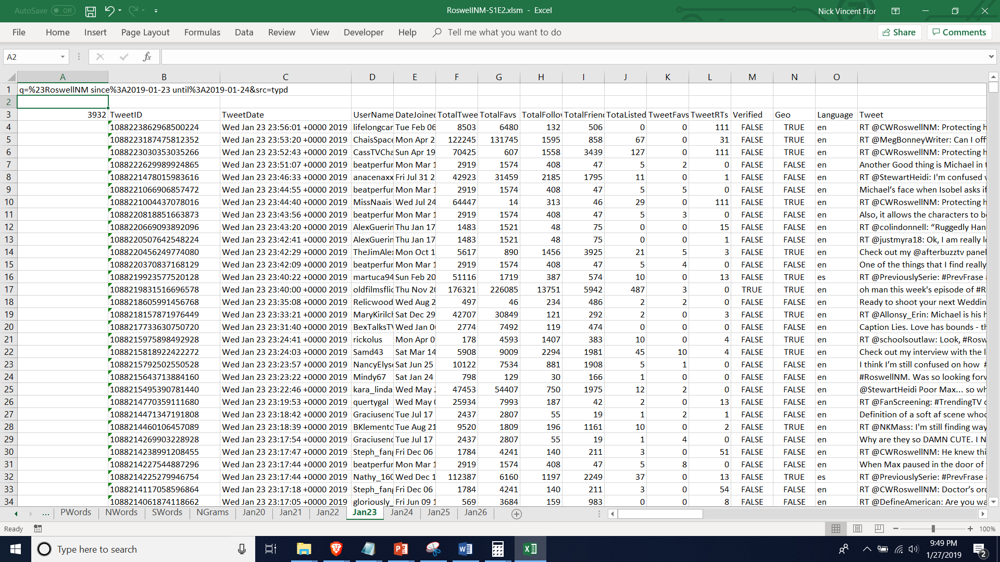

# Social Media Exploratory Data Analytics (SMEDA): An Excel Twitter Scraper With Basic Analytics
Nick V. Flor  
University of New Mexico  
27 January 2018  

Many information and learning science researchers prefer a more graphical user 
interface for the exploratory data analysis of Twitter data — compared to R or
Python scrapers. SMEDA (Social Media Exploratory Data Analytics) is a collection
of visual basic macros, that runs in Excel for Windows 10, that allows researchers
to scrape Twitter and provides basic exploratory data analytics including: 

1. Word frequency tables
2. User posting frequency tables
3. Tweet volume histograms
4. Retweet frequency tables
5. Sentiment analysis
6. Social edge generator
7. Document term matrix generator

SMEDA requires that you register a developer account on Twitter and insert your app keys into SMEDA. The ProfessorF website contains [detailed instructions](http://www.professorf.com/SMEDA) for setting up and running SMEDA
